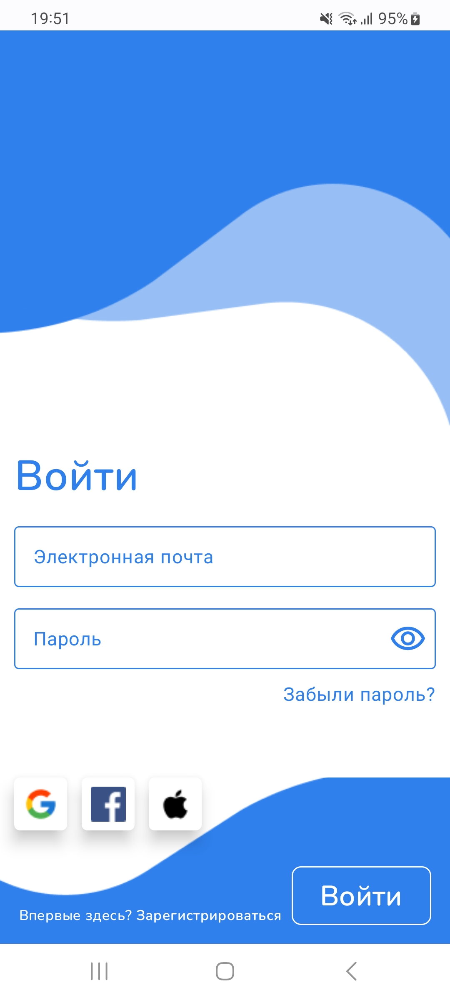
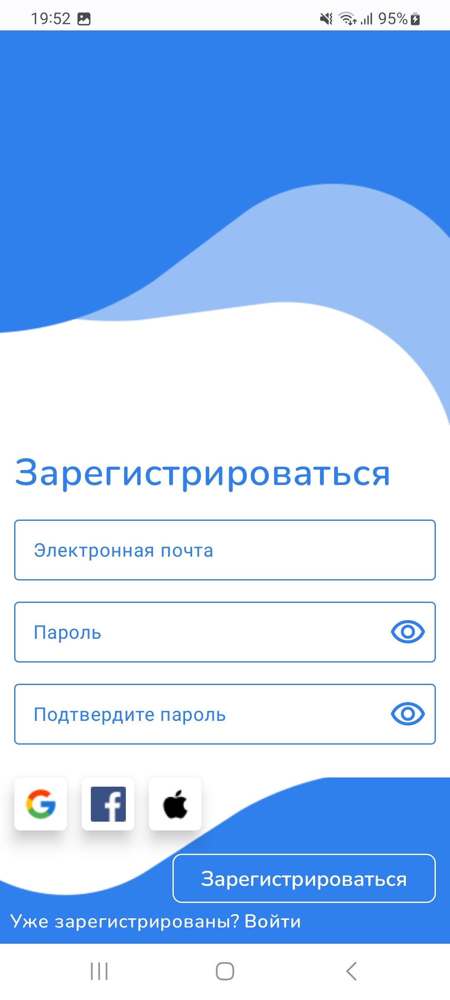
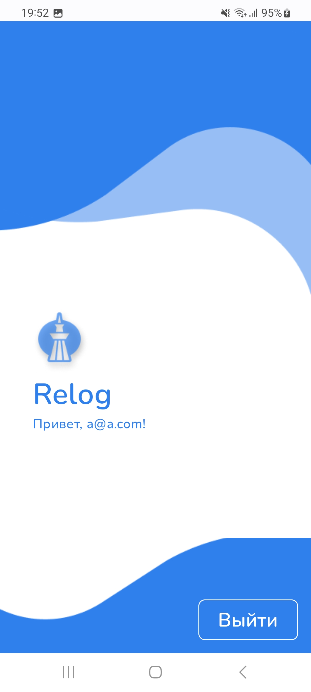

# Relog Test Task

Welcome to the Relog test task project! This project serves as an example of building a modern Android application using the latest technologies and best practices.

## 🖼️ Images




## 🛠️ Stack

The project is built using the following technologies:

- **Jetpack Compose**: For building responsive and beautiful UIs.
- **MVVM (Model-View-ViewModel)**: For a clean architecture that separates concerns.
- **Koin**: For dependency injection to manage and provide dependencies.

## ✨ Additional Features

The project also includes the following additional features:

- **Compose Navigation with Animations**: Navigate between screens with smooth animations.
- **3 Language Support**: The application supports English, Russian, and Kazakh languages.

## 🚀 Getting Started

To get started with the project, follow these steps:

1. **Clone the repository**:
   ```bash
   git clone https://github.com/your-username/relog-test-task.git
   cd relog-test-task
   ```

2. **Open the project** in Android Studio.

3. **Build and run** the project on an emulator or physical device.

## 🌐 Multi-language Support

The application supports three languages:

- **English** (default)
- **Russian** (ru)
- **Kazakh** (kz)

You can switch between these languages in the device settings to see the application in your preferred language.

## 🤝 Contributing

Contributions are welcome! If you find any issues or have suggestions for improvements, please feel free to open an issue or create a pull request.

1. Fork the project
2. Create your feature branch (`git checkout -b feature/your-feature`)
3. Commit your changes (`git commit -m 'Add your feature'`)
4. Push to the branch (`git push origin feature/your-feature`)
5. Open a pull request

## 📄 License

This project is licensed under the MIT License - see the [LICENSE](LICENSE) file for details.

## 📞 Contact

If you have any questions or need further information, feel free to contact me:

- **Email**: sarssetayabik@gmail.com
- **GitHub**: [Abylkairkhan](https://github.com/Abylkairkhan)

---

Thank you for checking out the Relog test task project! Happy coding! 🚀

---

This `README.md` provides a comprehensive and attractive overview of your project, making it easy for others to understand and get started with it.
